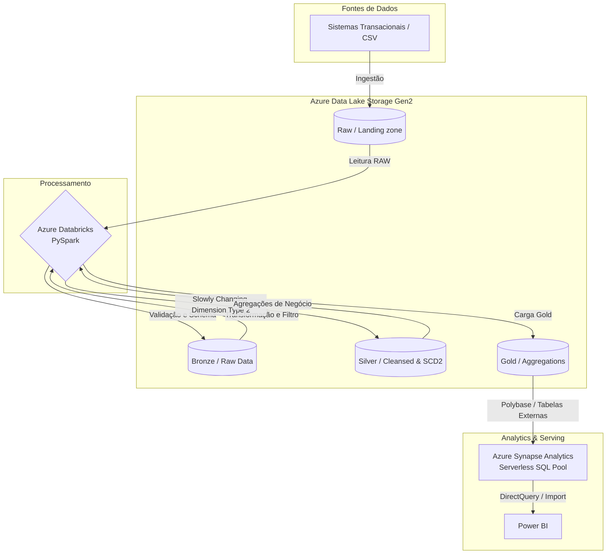

# NeoBank Data Platform

## 📌 Visão Geral
Projeto de Engenharia de Dados simulando o ambiente de um NeoBank. O objetivo é construir uma plataforma de dados moderna na nuvem (Azure), aplicando conceitos de Big Data, processamento distribuído (Apache Spark via Databricks) e Data Warehousing (Azure Synapse Analytics).

## 🏛️ Arquitetura (Medallion Architecture)

Utilizamos a arquitetura medalhão para garantir a qualidade e governança dos dados em diferentes estágios de refinamento.

👉 💸 **FinOps & Escalabilidade:** Desenvolvido com foco em Custo-Eficiência e limites corporativos (Enterprise). Confira nosso [Esboço de Estimativa de Custos e Escalabilidade](docs/cost_estimation_and_scale.md) para entender como essa POC roda por **$8.54/mês**, e exatamente quando a arquitetura deve escalar suas unidades de computação (DWUs e Spark Workers) para volumes de dados reais em Produção mínima.



## 📂 Estrutura do Repositório

Organizamos o código simulando um ambiente produtivo real:

```text
├── docs/                  # Documentação de arquitetura, dicionário de dados e decisões (ADRs)
├── src/
│   ├── notebooks/         # Notebooks exportados do Databricks (.ipynb / .py)
│   ├── sql/               # Scripts DDL/DML, criação de External Tables e Views no Synapse
│   └── pipelines/         # Arquivos de orquestração 
├── .gitignore             # Arquivos a serem ignorados pelo Git (.csv pesados, credenciais, etc)
└── README.md              # Este arquivo!
```

## 🚀 Tecnologias e Soluções Técnicas
- **Armazenamento:** Azure Data Lake Storage Gen2 (Arquitetura Medalhão: Bronze, Silver, Gold).
- **Processamento ELT:** Azure Databricks (Apache Spark / PySpark).
- **Data Warehouse:** Azure Synapse Analytics (Serverless SQL Pool, Dedicated SQL Pool, PolyBase).
- **Modelagem Analítica:** Implementação nativa de **Slowly Changing Dimensions (SCD Tipo 2)** no PySpark, preservando o histórico de dados na camada Silver.
- **Deduplicação Inteligente:** Uso de Window Functions (`row_number()`) e ordenação para ingestão da versão ativa do registro.
- **Performance de Consulta:** Tabela final provisionada com **Massively Parallel Processing (MPP)** usando `DISTRIBUTION = HASH` e indexação `CLUSTERED COLUMNSTORE INDEX` para Analytics.
- **Segurança (Estado da Arte):** **Unity Catalog com External Locations** (via Access Connector for Azure Databricks / Managed Identities). Nenhuma senha ou SAS Token fixo trafega no código PySpark!
